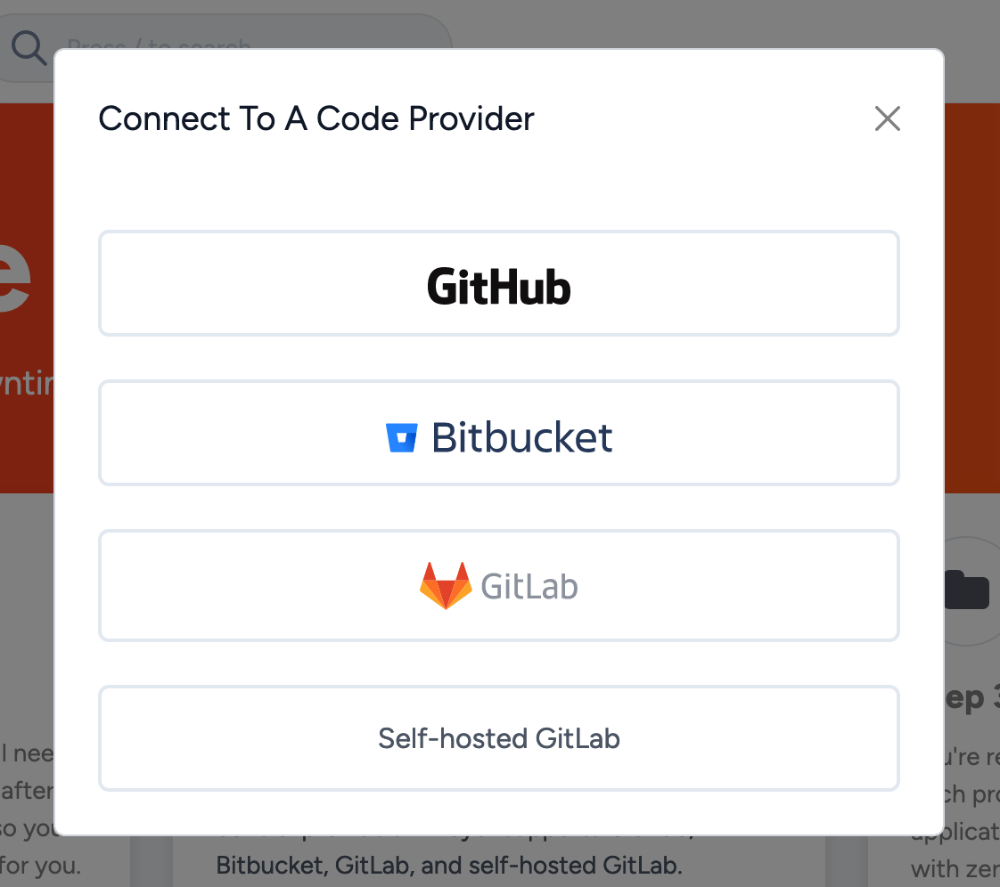
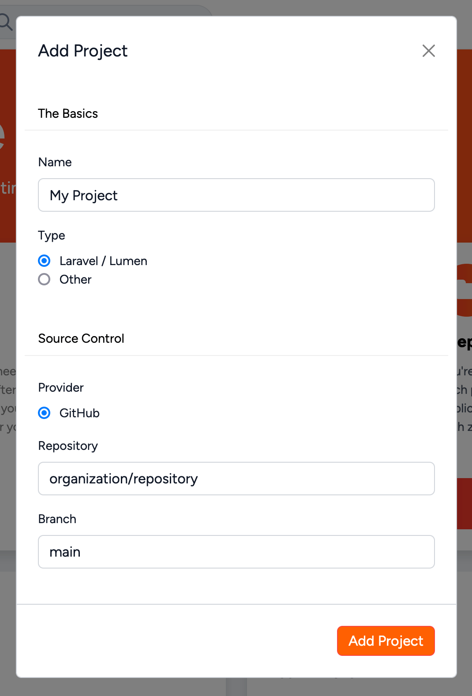
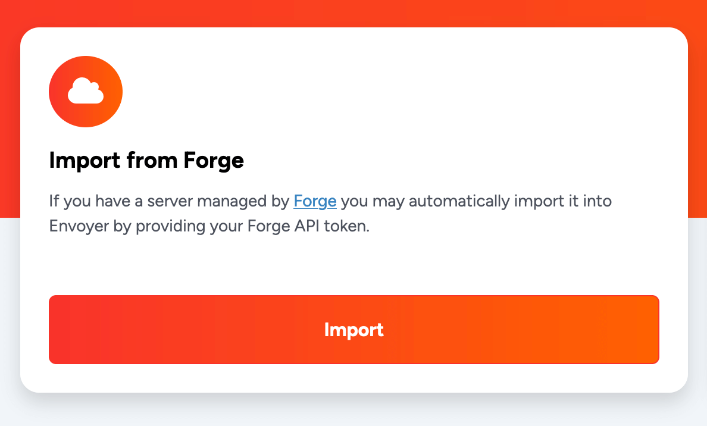
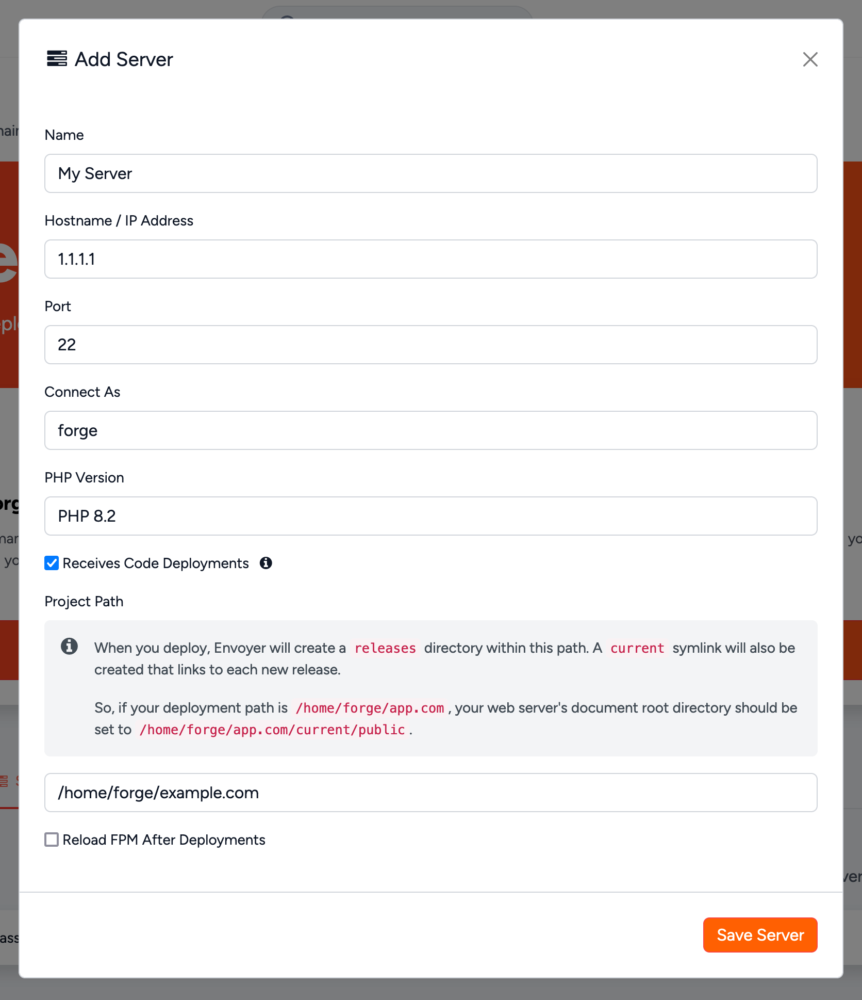
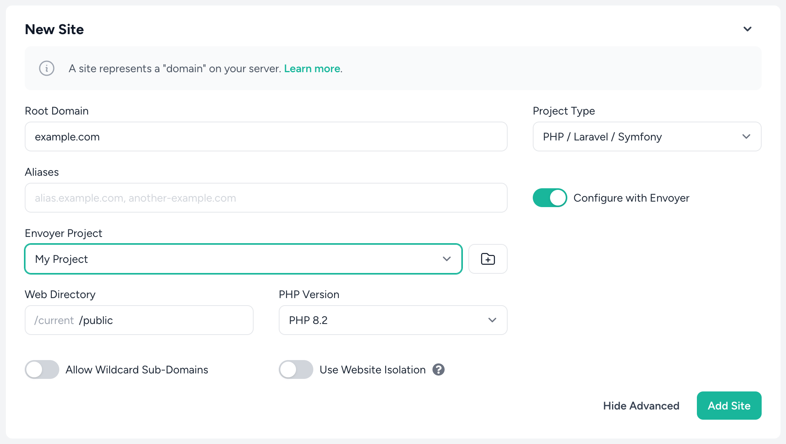
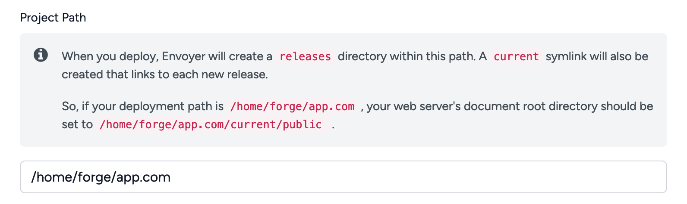
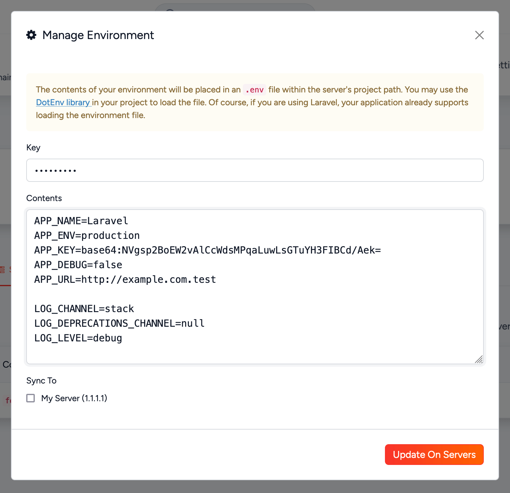

# Quick Start

[[toc]]

## Overview

The following documentation provides a step-by-step guide to configure your application and infrastructure for zero downtime deployments with Envoyer.

There are just a few simple and intuitive steps to get started.

## Source Control Providers

Once you have subscribed to a plan, you will need to connect Envoyer with your preferred source control provider. Envoyer supports GitHub, Bitbucket, GitLab, and self-hosted GitLab.

From the onboarding screen, select your provider and follow the authentication flow for that provider. This grants Envoyer permission to interact with your repositories on your behalf.

Once you've connected to your source control provider, this step of the onboarding flow will be complete. Should you wish to connect additional providers, you may do so from the [integrations](https://envoyer.io/user/profile#/integrations) panel of your account.

## Projects

With your source control provider connected, you can now configure your first project.

Click the "Add project" button to open the project creation modal.

Give your project a descriptive name and select the source control provider associated with your application.

Finally, enter the repository information in the format `organization/repository` along with the branch name you want to deploy. Envoyer will automatically deploy the provided branch unless this is overridden at the start of a deployment.

## Servers

With your project created, you now need to tell Envoyer which server or servers to deploy to. There are three ways to do this.

### Import From Forge

Envoyer has a first-party integration with [Laravel Forge](https://forge.laravel.com) - Laravel's preferred server provisioning and management platform - and you may import servers directly from Forge into your project.

Click the "Provide API Token" option from the onboarding screen and provide a [Forge API token](https://forge.laravel.com/user-profile/api). From the project overview, you may now select the "Import" option to open the import modal. From here, select the server and site you wish to import. Envoyer will retrieve the connection details of the server and automatically add an SSH key which allows it to connect.

### Manual Import

Don't worry if you're not using Forge; you may configure your server manually. Select the "Configure" option from the onboarding screen in the "Manual Configuration" section. After adding the [connection details](/projects/servers.html#server-configuration) for your server, add the provided SSH key to the `~/.ssh/authorized_keys` file for the users Envoyer should connect to the server as.

### Connect From Forge

It's also possible to attach a server to your Envoyer project [directly from Forge](https://forge.laravel.com/docs/sites/envoyer.html). When creating a new site on Laravel Forge, you may choose "Configure with Envoyer," allowing you to select the Envoyer project you wish the site to be attached to. Doing so will automatically configure the connection between Envoyer and Forge, install an SSH key, and set the path from which the project should be served.

## Deployments

The final part of your journey to zero downtime deployments is configuring what should happen during the deployment itself.

Envoyer provides a lot of flexibility and control over your deployments - you can read more about that in the [hooks](/projects/deployment-hooks.html) section, but for your first deployment, there are only two things to consider:

1. Which directory on your server(s) should Envoyer deploy your application?
2. Which directory should your application be served from?

You may configure the deployment directory by opening the "Update server" modal from your project's "Servers" tab.

Envoyer creates a `releases` directory in which your latest code is copied when you initiate a deployment. A `current` symlink is also created that links to the latest release.

If your deployment path is `/home/forge/app.com`, you should set your web server's document root directory to `/home/forge/app.com/current/public`.

:::info Adding Server From Forge
When adding a server to Envoyer from Forge, the application path and the web root are set automatically.
:::

Finally, Envoyer can manage your application's environment variables across all servers associated with a project. You should likely configure this before your first deployment.

You may do so by selecting "Manage Environment" from the project overview page. First, you must provide a key to encrypt the variables stored on our servers and choose the servers. Next, you can enter your variables and select which servers you wish to sync them to. Envoyer will then connect to the selected servers and sync the variables to a `.env` file in your chosen project path.

:::warning Managing Environment Variables

When using Envoyer, you should always manage your Environment variables via Envoyer's UI.
:::

With these steps completed, you may deploy your project by clicking the "Deploy" button from your project overview, which will open the deployment modal, allowing you to choose the branch or tag you wish to deploy.

Envoyer will attempt to connect to each server and clone the code of the chosen branch or tag of the configured repository into a new release directory. Next, Composer dependencies are installed before the symlink is updated, making the new release live.

**Congratulations, you've just successfully completed your first zero downtime deployment.**
